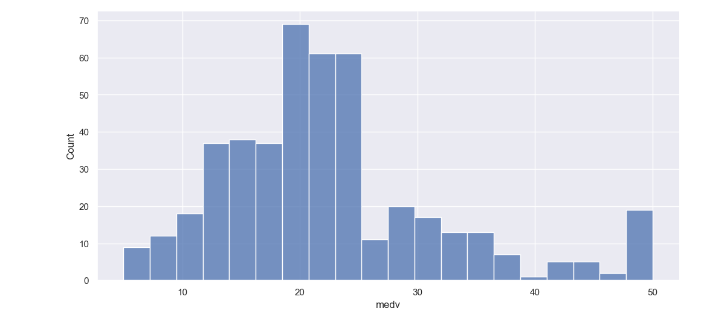
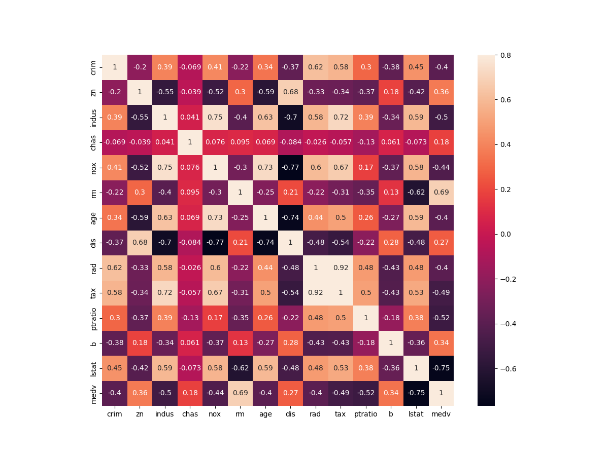
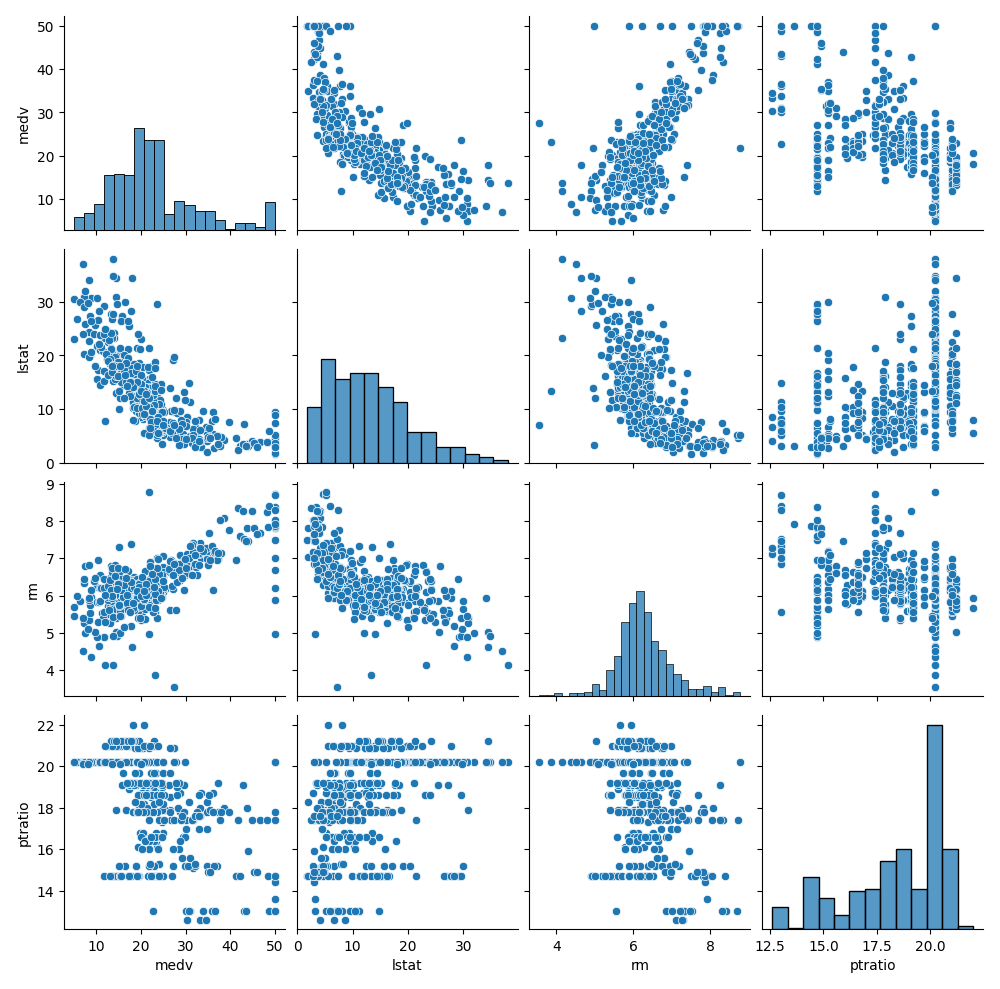
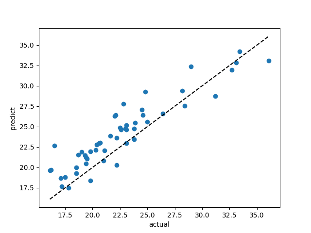

 # <center>人工智能原理课程实验报告</center>
 ## <center>手写识别 </center>
<br>
<br>
<br>

<br>


 ---

##  任务要求
- 实现28x28像素输入的手写数字识别
- 利用MNIST的手写数字集进行训练
- 选择合适模型训练
- 输出对应结果0-9的数字标签

 ---

##  数据导入
1. 使用pytorch导入MNIST数据集
```python
from torchvision.datasets import MNIST
```
- MNIST数据中有`images.idx3-ubyte`和`labels.idx1-ubyte`，分别存储了图片和标签
```
TEST SET IMAGE FILE (t10k-images-idx3-ubyte):
[offset] [type]          [value]          [description] 
0000     32 bit integer  0x00000803(2051) magic number 
0004     32 bit integer  10000            number of images 
0008     32 bit integer  28               number of rows 
0012     32 bit integer  28               number of columns 
0016     unsigned byte   ??               pixel 
0017     unsigned byte   ??               pixel 
........ 
```
- 8-bit （1 byte ) 来表示一个pixel 的灰度，0 表示纯白色，255表示纯黑色，共256个灰度级别。
<br>
2. 加载数据集
- 使用`DataLoader`加载数据
- 利用`transforms.ToTensor()`完成28x28像素张量的转换
```python
from torch.utils.data import DataLoader
from torchvision import transforms
def get_data_loader(is_train):
    to_tensor = transforms.Compose([transforms.ToTensor()]) #转换为张量
    data_set = MNIST(root='./data/',train=is_train,transform=to_tensor,download=True)
    return DataLoader(data_set,batch_size=BATCH_SIZE,shuffle=True,pin_memory=True)
    # 每次训练量BATCH_SIZE先定为16
```
- 划分训练集和测试集
```python
    train_data = get_data_loader(is_train=True)   
    test_data = get_data_loader(is_train=False)
```

 ---

## 构建神经网络
***采用一个简单的前馈神经网络，设置四个全连接层***
1. 利用pytorch定义一个`Net`类，继承自`torch.nn.Module`
- 设置神经网络结构

```python
    def __init__(self):
        super().__init__()
        self.layer1 = torch.nn.Linear(28*28,64)  #输入层接受28x28像素的图像作为输入。
        self.layer2 = torch.nn.Linear(64,64)    #隐藏层为64个节点的全连接层
        self.layer3 = torch.nn.Linear(64,64)
        self.layer4 = torch.nn.Linear(64,10)    #输出10个数字类别
```
2. 定义前向传播
- 层之间使用ReLU激活函数
$ReLU(x) = \begin{cases}
x, & \text{if } x \geq 0 \\
0, & \text{if } x < 0
\end{cases}$
- 输出层使用`softmax`归一化,取对数提高稳定性
$Softmax(x_i) = \frac{e^{x_i}}{{\sum_j e^{x_j}}}$
```python
    def forward(self,x):  #向前传播
        x = torch.nn.functional.relu(self.layer1(x))  
        x = torch.nn.functional.relu(self.layer2(x))  #套上ReLU激活函数
        x = torch.nn.functional.relu(self.layer3(x))
        x = torch.nn.functional.log_softmax(self.layer4(x),dim=1) 
        #用softmax归一化 log对其取对数提高稳定性
        return x
```
 ---

## 使用GPU进行训练
- 利用`torch.cuda.is_available()`判断并选择是否使用GPU
```python
device=torch.device( "cuda:0" if torch.cuda.is_available() else "cpu")
```
- 将数据转入device进行训练
```python
    def forward(self,x)
        x = x.to(device)
        ...
    def main():
        ...
        net =net.to(device)
        ...   
            output = output.to(device)
            y = y.to(device)
            ...
```

- GPU训练

    
 ---

## 模型训练

1. 定义损失函数
```python
 loss = torch.nn.functional.nll_loss(output,y)
```
- 使用nll_loss 负对数似然损失函数，其通常用于多类别分类问题，衡量预测概率与真实标签之间的差异。
$ \text{{nll\_loss}}(x, \text{{target}}) = -\log(x[\text{{target}}])$

2. 更新网络
- 使用 `Adam` 优化器更新网络参数
>Adam 是一种可以替代传统随机梯度下降过程的一阶优化算法，它能基于训练数据迭代地更新神经网络权重。Adam 算法和传统的随机梯度下降不同。随机梯度下降保持单一的学习率（即 alpha）更新所有的权重，学习率在训练过程中并不会改变。而 Adam 通过计算梯度的一阶矩估计和二阶矩估计而为不同的参数设计独立的自适应性学习率。

```python
optimizer = torch.optim.Adam(net.parameters(),lr=0.001)
    ...
        net.zero_grad()
        ···
        loss.backward()
        optimizer.step()
```
- `net.parameters()` 函数返回一个可迭代对象，其中包含神经网络的所有参数。这些参数包括网络中每一层的权重和偏置。优化器将根据训练过程中计算得到的梯度来更新这些参数。
- 学习率`lr=0.001` ，决定了优化器调整参数的步长
<br>
- `net.zero_grad()`清除神经网络中所有参数的梯度, 梯度用于在训练过程中更新权重和偏置。通过将梯度归零，确保前一次迭代的梯度不会累积。
<br>
-  `loss.backward()`计算损失相对于神经网络参数的梯度, 它使用反向传播算法通过从输出层到输入层传播误差来高效计算梯度。
<br>
- `optimizer.step()`更新神经网络中的参数，以最小化损失函数。它使用优化器中定义的更新规则来更新参数。

 ---

## 训练效果评估
1. 预测结果
```python
    for (x, y) in test_data:
        outputs = net.forward(x.view(-1,28*28)) 
```
- 预测值为`torch.argmax(output)`返回张量中最大值的索引+1
2. 定义一个函数返回混淆矩阵, 其中每行为真实标签，每列为预测标签
```python
def evaluate(test_data,net):
    confusion_matrix=[[0 for _ in range(10)] for _ in range(10)]
    with torch.no_grad():
        for (x, y) in test_data:
            outputs = net.forward(x.view(-1,28*28)) #导出预测值
            for i, output in enumerate(outputs): #第i个数据
                confusion_matrix[y[i]][torch.argmax(output)]+=1 #混淆矩阵
    return confusion_matrix
```
3. 训练4个epoch，每次结束后打印准确率
```python
    for epoch in range(EPOCH):
        ...
        accuracy = sum([result[i][i] for i in range(10)])/sum([sum(result[i]) for i in range(10)])
        print("epoch",epoch+1,"accuracy",accuracy)
```

>训练结果：
use cuda:0
epoch 1 accuracy 0.9546
epoch 2 accuracy 0.9673
epoch 3 accuracy 0.9686
epoch 4 accuracy 0.9709

- 可以看到，每次训练完成后，基本能到达97%的准确率

4. 在全部训练完成后，绘制混淆矩阵
```python
    def show(confusion_matrix):
        ···   
        plt.imshow(confusion_matrix, cmap='Blues')
        ···
    for epoch in range(EPOCH):
        ···
    show(result)
```


 ---

## 模型保存与加载
1. 利用`torch.save()`, 将模型参数`state_dict()`保存
torch.nn.Module模块中的state_dict变量存放训练过程中需要学习的权重和偏执系数，state_dict作为python的字典对象将每一层的参数映射成tensor张量
```python
torch.save(net.state_dict(),'simpleNN_Model.pth') 
```
2. 利用`torch.load()`加载模型参数 `.eval()`将模型设置为评估模式以用于推理
```python
from simpleNN import Net
import torch
model=Net()
model.load_state_dict(torch.load('simpleNN_Model.pth'))
model.eval()
```

 ---

## 总结与体会
>机器学习分类问题是指根据已有的数据集，通过学习数据的模式和特征，将新的输入数据分为不同的类别,分类问题可以是二分类（两个类别）或多分类（多个类别）。
1. ***神经网络*** 是一种模拟人脑神经元之间连接的数学模型。它由多个层组成，每一层包含多个神经元，通过学习权重和偏置来建立输入和输出之间的复杂非线性关系。神经网络可以用于解决各种机器学习任务，包括分类问题。
<br>

2. ***图像数据*** 是一种多维数据，通常由像素组成。
- 训练前通常需要对图像进行预处理。预处理包括图像的缩放、裁剪、旋转、去噪等操作，以确保图像具有一致的尺寸、方向和质量

- 图像通常以RGB（红绿蓝）色彩空间表示，但在某些情况下，将图像转换为其他色彩空间（如灰度、HSV、Lab等）可能更有利于特征提取

- 训练中需要从图像中提取有意义的信息或特征。常用的特征提取方法包括直方图、边缘检测、纹理特征、颜色直方图等。这些特征可以用于描述图像的形状、纹理、颜色等特性。

3. ***混淆矩阵*** 是一种可视化工具，用于衡量分类模型的性能。
- 它以表格的形式显示了模型预测结果和真实标签之间的关系。混淆矩阵的每一行表示真实标签，每一列表示预测标签。
- 混淆矩阵的对角线表示模型正确预测的结果，而非对角线表示模型错误预测的结果。

4. ***常用的神经网络模型*** 
- 前馈神经网络是最基本的神经网络模型，由输入层、隐藏层和输出层组成。信息在网络中单向传递，不会形成循环连接。前馈神经网络适用于解决分类和回归问题。
- 卷积神经网络是专门用于处理图像和视觉数据的神经网络模型。它通过卷积层、池化层和全连接层来提取图像中的特征，并进行分类或回归任务。卷积神经网络在计算机视觉领域有很不错的效果。
- 循环神经网络是一种具有循环连接的神经网络模型，用于处理序列数据，如自然语言处理和时间序列预测。循环神经网络可以捕捉到序列数据中的时序信息，并具有记忆能力。
- 长短期记忆网络是一种特殊类型的循环神经网络，用于解决传统循环神经网络中的梯度消失和梯度爆炸问题。它通过门控机制来控制信息的流动，能够更好地捕捉长期依赖关系
- 生成对抗网络由生成器和判别器两个部分组成，通过对抗训练的方式来生成逼真的样本。生成对抗网络在图像生成、图像修复和图像转换等任务中表现出色。

5. ***损失函数***  是用来衡量模型预测结果与真实标签之间的差异的函数，用于指导模型参数的优化，常见的损失函数有：
- 均方误差（Mean Squared Error，MSE）：用于回归任务，计算预测值与真实值之间的平均平方差。
- 交叉熵损失（Cross-Entropy Loss）：用于分类任务，衡量预测类别与真实类别之间的差异。
- 对数损失（Log Loss）：用于二分类任务，衡量预测概率与真实标签之间的差异。
- KL散度（Kullback-Leibler Divergence）：用于衡量两个概率分布之间的差异。 ······

6. ***优化器*** 是用来更新神经网络参数的算法，常见的优化器有：
- 随机梯度下降（Stochastic Gradient Descent，SGD）：基本的优化算法，通过计算损失函数的梯度来更新参数。
- Adam：结合了动量法和自适应学习率的优化算法，适用于大多数深度学习任务。
- RMSprop：自适应学习率的优化算法，适用于处理非平稳目标和长期依赖问题。
- Adagrad：自适应学习率的优化算法，适用于稀疏数据集。······
 

 ---
 
<div STYLE="page-break-after: always;"></div> 

 ---

 ---
 # <center>人工智能原理课程实验报告</center>
 ## <center>波士顿房价预测 </center>
<br>
<br>
<br>
<p align="right"> 学号：2022214191 </p>
<p align="right"> 姓名：　 曾振杰　</p>

 ---
##  任务要求

- 预测地区房价
- 分析和选择房屋周围地区影响房价的13个特征属性
- 选择合适的模型训练并对mdev进行预测
- 训练测试和模型优化

---
## 数据分析
1. ***导入数据***
- 数据存储格式为.csv 为一系列逗号隔开的数据，使用pandas库中的`read_csv()`函数读取数据
```python
dataframe_train = pd.read_csv('data\BostonHousing_train.csv')
dataframe_test = pd.read_csv('data\BostonHousing_test.csv')
```
- 得到二维表格数据结构`DataFrame`


2. ***数据分析***
- 检查输入数据情况
```python
print(dataframe_train.info())  # 检查数据集
print(dataframe_train['medv'].describe())  # 检查dev
```
```
Data columns (total 14 columns):
 #   Column   Non-Null Count  Dtype  
---  ------   --------------  -----  
 0   crim     455 non-null    float64
 1   zn       455 non-null    float64
 2   indus    455 non-null    float64
 3   chas     455 non-null    int64  
......

```
发现数据正常导入且没有缺失值
- 查看目标值的分布情况
```python
    sns.displot(dataframe_train['medv'])  # 绘制直方图
    plt.show()  # 绘制直方图
```


发现medv的分布有一点的右偏, `偏度: 1.08   峰度: 1.24`
- 查看相关系数
```python
    corrmat = dataframe_train.corr()
    print(corrmat['medv'].sort_values(ascending=False))   
```
也可直接看整体热力图
```python
    sns.heatmap(corrmat, vmax=.8, square=True,annot=True)
    plt.show()
```

- 查看各个特征与medv的散点图
```python
    cols =pd.Index(['medv']).append(corrmat['medv'].
                sort_values(key=lambda x:abs(x),ascending=False)[1:4].index) #选择范围
    sns.pairplot(dataframe_train[cols], height = 2.5)
    plt.show()
```

关于特征选择：由于数据集中特征数较少，故选择所有特征训练
另外观察与medv相关性高的几个特征，无明显异常值，故不做处理

- 另外可尝试对medv正态化,以下为正态化后的分布图和QQ线（右）
```python
if_norm = False
def normalize():
    global if_norm,y_train
    if_norm = True
    dataframe_train["medv"] = np.log1p(dataframe_train["medv"])
    y_train = dataframe_train['medv'].values
```

 

　　　　　　　　　　　　　　　　　　　　　　　　　　　　
<br>

 ---

##  模型选择与训练
1. 尝试使用线性回归模型
```python
    from sklearn.linear_model import LinearRegression
    model = LinearRegression()
```
2. 定义一个评估函数，用于训练并评估模型
- 使用R2决定系数和平方根误差RMSE作为评估指标
$R^2 = 1 - \frac{\sum_{i=1}^{n}(y_i - \hat{y_i})^2}{\sum_{i=1}^{n}(y_i - \bar{y})^2}$
$RMSE = \sqrt{\frac{1}{n} \sum_{i=1}^{n}(y_i - \hat{y_i})^2}$
```python
from sklearn.metrics import mean_squared_error,r2_score  
def evaluate(model): 
    model.fit(x_train, y_train)
    if if_norm:   
        pred = np.expm1(model.predict(x_test)) # exp(x)-1 使预测值正常化
    else:
        pred = model.predict(x_test)
    rmse = mean_squared_error(y_test, pred, squared=False) 
    return (r2_score(y_true=y_test,y_pred=pred),rmse)
```
- 尝试选择不同模型进行测试
```python
from sklearn.linear_model import LinearRegression,ElasticNet, Lasso, BayesianRidge, LassoLarsIC #线性回归模型
from sklearn.ensemble import RandomForestRegressor, GradientBoostingRegressor #集成模型
from sklearn.kernel_ridge import KernelRidge #核岭回归

from sklearn.pipeline import make_pipeline #pipeline
from sklearn.preprocessing import RobustScaler #鲁棒缩放

le=LinearRegression()
lasso = make_pipeline(RobustScaler(), Lasso(alpha=0.0005, random_state=1))
ENet = make_pipeline(RobustScaler(), ElasticNet(alpha=0.0005, l1_ratio=.9, random_state=3))
bayesian_ridge = make_pipeline(RobustScaler(),BayesianRidge())
lasso_lars_ic = make_pipeline(RobustScaler(),LassoLarsIC())
random_forest = make_pipeline(RobustScaler(),RandomForestRegressor())
gradient_boosting = make_pipeline(RobustScaler(),GradientBoostingRegressor(alpha=0.9, learning_rate=0.05, n_estimators=300))
KRR = make_pipeline(RobustScaler(),KernelRidge(alpha=0.6, kernel='polynomial', degree=2, coef0=2.5))
```
- 定义一个`test()`函数，用于测试不同模型
```python
def test():
    for i,model in enumerate(models):
        result = evaluate(model)
        print(f'\n{models_name[i]}: \nR2_Score: {result[0]}   \nRSME: {result[1]}')
```
- 执行测试后，发现岭回归模型效果最好(mdev正态化后)
>   KRR:
>   R2_Score: 0.7429659197208998
>   RSME: 2.355656124194381

岭回归是一种常用的回归算法，用于处理具有多重共线性（即特征之间高度相关）的数据。它通过在损失函数中添加一个正则化项，控制模型的复杂度，从而减小过拟合的风险。岭回归的核心思想是通过平衡模型的拟合能力和泛化能力，提高模型的稳定性和预测性能。
- 查看测试集真实值与预测值的散点图
```python
def compare(model):
    plt.xlabel("actual")
    plt.ylabel("predict")
    plt.scatter(x=y_test, y=np.expm1(model.predict(x_test)))
    plt.plot([y_test.min(), y_test.max()],[y_test.min(), y_test.max()],'k--')
    plt.show()
normalize()
KRR.fit(x_train, y_train)
compare(KRR)
``` 


## 模型保存和输入输出
- 保存模型
```python
import joblib
def save_model(model):
    joblib.dump(model, 'model.pkl')
```
- 输入输出 使用两个文件`input.csv`和`output.csv`进行操作
```python
def load_model():
    model = joblib.load('model.pkl')
    return model

def main():
    model=load_model() #加载模型
    input_data = pd.read_csv("input.csv") #读取输入数据
    result = np.expm1(model.predict(input_data)) #如果对medv使用了正态化
    sub=pd.DataFrame()
    sub['pridict_medv']=result  
    sub.to_csv('output.csv',index=False)  #保存结果
```

## 总结与体会
>机器学习回归任务是一种通过机器学习中的一种监督学习任务，通过学习输入特征与连续数值输出之间的关系训练模型来预测连续数值输出的任务。

1. ***任务的目标***：找到一个函数 f(x) 来建立输入特征 X 和目标变量 y 之间的关系，使得 f(x) 能够对新的输入样本进行预测。

- 一般来说，回归模型的数学公式可以表示为：
$y = f(x) + ε$

- 具体的回归模型可以有不同的形式,以线性回归为例,有：
$y = β_0 + β_1x_1 + β_2x_2 + ... + β_nx_n + ε$


2.  ***特征表示***：
- 回归任务中，输入数据通常由多个特征组成，每个特征可以是数值型、类别型或者其他类型。
- *其中只有数值型才可输入模型因此若果涉及到非数值型数据，需要在特征工程部分进行处理*

- 特征表示对于回归模型的性能至关重要，合适的特征表示可以提取出数据中的有用信息，帮助模型更好地进行预测。

3. ***处理缺失值和离群点***：
- 回归任务中，有些数据可能存在缺失，可以通过删除或插值、利用模型预测填补等方法处理
- 由于测量误差、数据录入错误、异常事件等原因可能导致有与其他观测值明显不同的异常值，这些离群点可能对模型的性能产生不良影响，常见处理方法有删除、替换、转换、鲁棒模型、数据分段等

4. ***常见的回归模型***:包括线性回归、岭回归、Lasso回归、决策树回归、支持向量回归等。选择合适的模型取决于数据的特点以及模型的假设和性能要求。
<br>
5. ***模型评估***：为了评估回归模型的性能，常用的指标包括均方根误差（Root Mean Squared Error，RMSE）、平均绝对误差（Mean Absolute Error，MAE）、决定系数（Coefficient of Determination，R2）等。这些指标可以衡量模型的预测准确度、稳定性和拟合程度。


