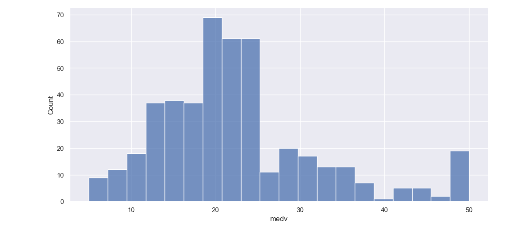
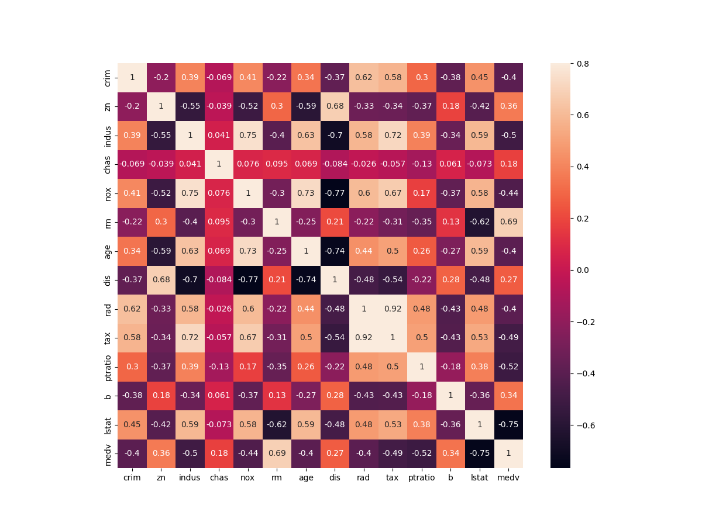
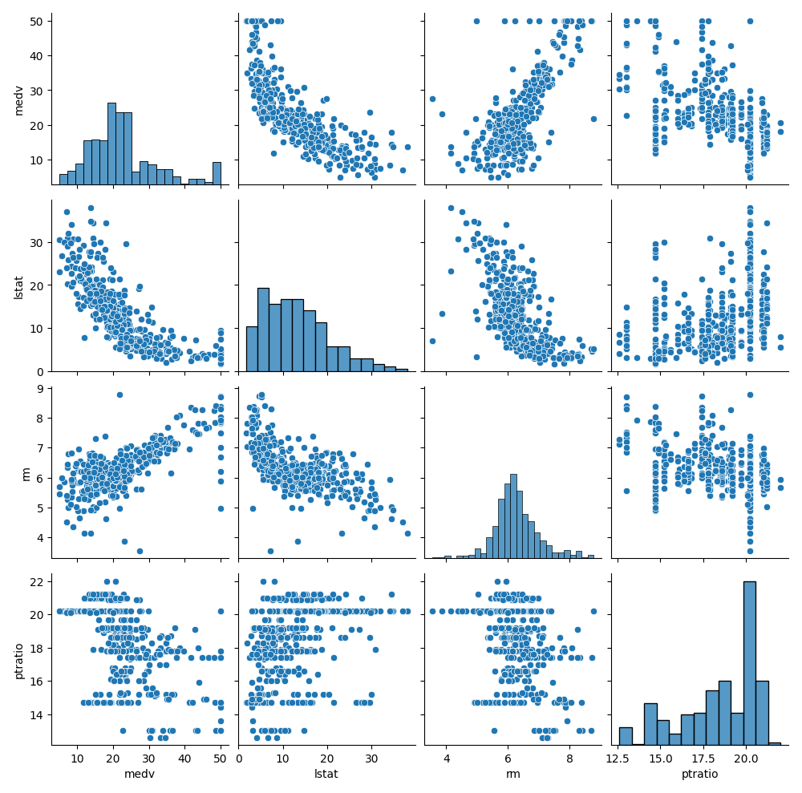
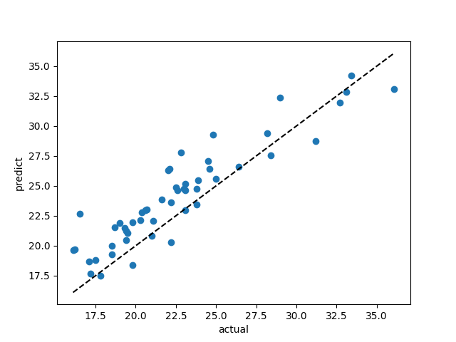

 ---
 # <center>人工智能原理课程实验报告</center>
 ## <center>波士顿房价预测 </center>
<br>
<br>

 ---
##  任务要求

- 预测地区房价
- 分析和选择房屋周围地区影响房价的13个特征属性
- 选择合适的模型训练并对mdev进行预测
- 训练测试和模型优化

---
## 数据分析
1. ***导入数据***
- 数据存储格式为.csv 为一系列逗号隔开的数据，使用pandas库中的`read_csv()`函数读取数据
```python
dataframe_train = pd.read_csv('data\BostonHousing_train.csv')
dataframe_test = pd.read_csv('data\BostonHousing_test.csv')
```
- 得到二维表格数据结构`DataFrame`


2. ***数据分析***
- 检查输入数据情况
```python
print(dataframe_train.info())  # 检查数据集
print(dataframe_train['medv'].describe())  # 检查dev
```
```
Data columns (total 14 columns):
 #   Column   Non-Null Count  Dtype  
---  ------   --------------  -----  
 0   crim     455 non-null    float64
 1   zn       455 non-null    float64
 2   indus    455 non-null    float64
 3   chas     455 non-null    int64  
......

```
发现数据正常导入且没有缺失值
- 查看目标值的分布情况
```python
    sns.displot(dataframe_train['medv'])  # 绘制直方图
    plt.show()  # 绘制直方图
```


发现medv的分布有一点的右偏, `偏度: 1.08   峰度: 1.24`
- 查看相关系数
```python
    corrmat = dataframe_train.corr()
    print(corrmat['medv'].sort_values(ascending=False))   
```
也可直接看整体热力图
```python
    sns.heatmap(corrmat, vmax=.8, square=True,annot=True)
    plt.show()
```

- 查看各个特征与medv的散点图
```python
    cols =pd.Index(['medv']).append(corrmat['medv'].
                sort_values(key=lambda x:abs(x),ascending=False)[1:4].index) #选择范围
    sns.pairplot(dataframe_train[cols], height = 2.5)
    plt.show()
```

关于特征选择：由于数据集中特征数较少，故选择所有特征训练
另外观察与medv相关性高的几个特征，无明显异常值，故不做处理

- 另外可尝试对medv正态化 
```python
if_norm = False
def normalize():
    global if_norm,y_train
    if_norm = True
    dataframe_train["medv"] = np.log1p(dataframe_train["medv"])
    y_train = dataframe_train['medv'].values
```

 

　　　　　　　　　　　　　　　　　　　　　　　　　　　　
<br>

 ---

##  模型选择与训练
1. 尝试使用线性回归模型
```python
    from sklearn.linear_model import LinearRegression
    model = LinearRegression()
```
2. 定义一个评估函数，用于训练并评估模型
- 使用R2决定系数和平方根误差RMSE作为评估指标
$R^2 = 1 - \frac{\sum_{i=1}^{n}(y_i - \hat{y_i})^2}{\sum_{i=1}^{n}(y_i - \bar{y})^2}$
$RMSE = \sqrt{\frac{1}{n} \sum_{i=1}^{n}(y_i - \hat{y_i})^2}$
```python
from sklearn.metrics import mean_squared_error,r2_score  
def evaluate(model): 
    model.fit(x_train, y_train)
    if if_norm:   
        pred = np.expm1(model.predict(x_test)) # exp(x)-1 使预测值正常化
    else:
        pred = model.predict(x_test)
    rmse = mean_squared_error(y_test, pred, squared=False) 
    return (r2_score(y_true=y_test,y_pred=pred),rmse)
```
- 尝试选择不同模型进行测试
```python
from sklearn.linear_model import LinearRegression,ElasticNet, Lasso, BayesianRidge, LassoLarsIC #线性回归模型
from sklearn.ensemble import RandomForestRegressor, GradientBoostingRegressor #集成模型
from sklearn.kernel_ridge import KernelRidge #核岭回归

from sklearn.pipeline import make_pipeline #pipeline
from sklearn.preprocessing import RobustScaler #鲁棒缩放

le=LinearRegression()
lasso = make_pipeline(RobustScaler(), Lasso(alpha=0.0005, random_state=1))
ENet = make_pipeline(RobustScaler(), ElasticNet(alpha=0.0005, l1_ratio=.9, random_state=3))
bayesian_ridge = make_pipeline(RobustScaler(),BayesianRidge())
lasso_lars_ic = make_pipeline(RobustScaler(),LassoLarsIC())
random_forest = make_pipeline(RobustScaler(),RandomForestRegressor())
gradient_boosting = make_pipeline(RobustScaler(),GradientBoostingRegressor(alpha=0.9, learning_rate=0.05, n_estimators=300))
KRR = make_pipeline(RobustScaler(),KernelRidge(alpha=0.6, kernel='polynomial', degree=2, coef0=2.5))
```
- 定义一个`test()`函数，用于测试不同模型
```python
def test():
    for i,model in enumerate(models):
        result = evaluate(model)
        print(f'\n{models_name[i]}: \nR2_Score: {result[0]}   \nRSME: {result[1]}')
```
- 执行测试后，发现岭回归模型效果最好(mdev正态化后)
>   KRR:
>   R2_Score: 0.7429659197208998
>   RSME: 2.355656124194381

岭回归是一种常用的回归算法，用于处理具有多重共线性（即特征之间高度相关）的数据。它通过在损失函数中添加一个正则化项，控制模型的复杂度，从而减小过拟合的风险。岭回归的核心思想是通过平衡模型的拟合能力和泛化能力，提高模型的稳定性和预测性能。
- 查看测试集真实值与预测值的散点图
```python
def compare(model):
    plt.xlabel("actual")
    plt.ylabel("predict")
    plt.scatter(x=y_test, y=np.expm1(model.predict(x_test)))
    plt.plot([y_test.min(), y_test.max()],[y_test.min(), y_test.max()],'k--')
    plt.show()
normalize()
KRR.fit(x_train, y_train)
compare(KRR)
``` 


## 模型保存和输入输出
- 保存模型
```python
import joblib
def save_model(model):
    joblib.dump(model, 'model.pkl')
```
- 输入输出 使用两个文件`input.csv`和`output.csv`进行操作
```python
def load_model():
    model = joblib.load('model.pkl')
    return model

def main():
    model=load_model() #加载模型
    input_data = pd.read_csv("input.csv") #读取输入数据
    result = np.expm1(model.predict(input_data)) #如果对medv使用了正态化
    sub=pd.DataFrame()
    sub['pridict_medv']=result  
    sub.to_csv('output.csv',index=False)  #保存结果
```

## 总结与体会
>机器学习回归任务是一种通过机器学习中的一种监督学习任务，通过学习输入特征与连续数值输出之间的关系训练模型来预测连续数值输出的任务。

1. ***任务的目标***：找到一个函数 f(x) 来建立输入特征 X 和目标变量 y 之间的关系，使得 f(x) 能够对新的输入样本进行预测。

- 一般来说，回归模型的数学公式可以表示为：
$y = f(x) + ε$

- 具体的回归模型可以有不同的形式,以线性回归为例,有：
$y = β_0 + β_1x_1 + β_2x_2 + ... + β_nx_n + ε$


2.  ***特征表示***：
- 回归任务中，输入数据通常由多个特征组成，每个特征可以是数值型、类别型或者其他类型。
- *其中只有数值型才可输入模型因此若果涉及到非数值型数据，需要在特征工程部分进行处理*

- 特征表示对于回归模型的性能至关重要，合适的特征表示可以提取出数据中的有用信息，帮助模型更好地进行预测。

3. ***处理缺失值和离群点***：
- 回归任务中，有些数据可能存在缺失，可以通过删除或插值、利用模型预测填补等方法处理
- 由于测量误差、数据录入错误、异常事件等原因可能导致有与其他观测值明显不同的异常值，这些离群点可能对模型的性能产生不良影响，常见处理方法有删除、替换、转换、鲁棒模型、数据分段等

4. ***常见的回归模型***:包括线性回归、岭回归、Lasso回归、决策树回归、支持向量回归等。选择合适的模型取决于数据的特点以及模型的假设和性能要求。
<br>
5. ***模型评估***：为了评估回归模型的性能，常用的指标包括均方根误差（Root Mean Squared Error，RMSE）、平均绝对误差（Mean Absolute Error，MAE）、决定系数（Coefficient of Determination，R2）等。这些指标可以衡量模型的预测准确度、稳定性和拟合程度。

